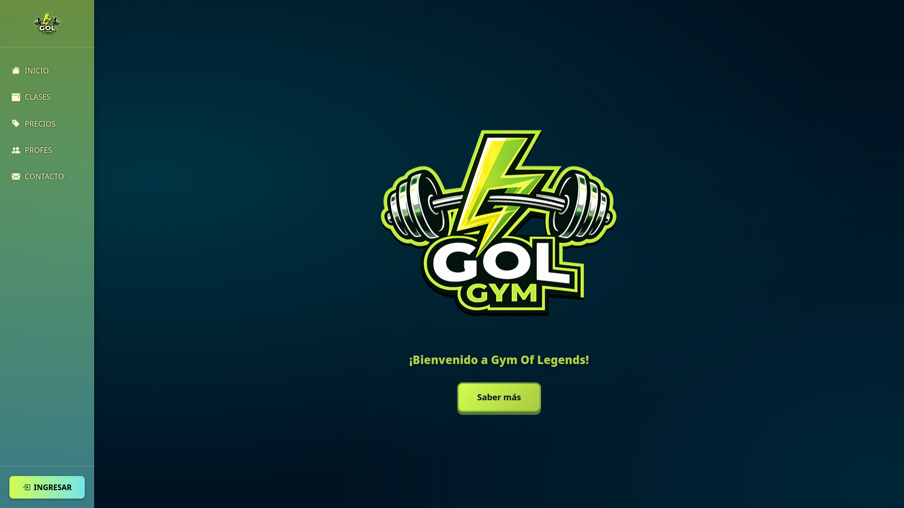
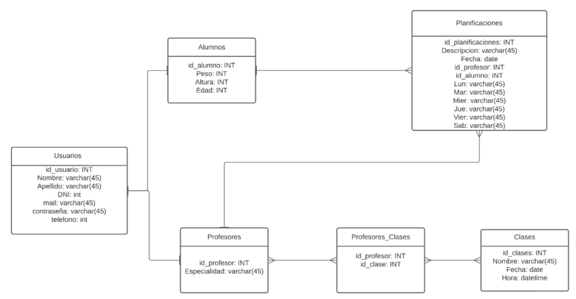

<h1 align="center">
🏋️‍♂️ GOL GYM - Proyecto Programación 1
</h1>



## Figma
[👉 Acceder al diseño en Figma](https://www.figma.com/file/eMVja4xZXQaOs7R6Dxjofd/Grupo_B?type=design&node-id=0%3A1&mode=design&t=wmPhyalveFt5GsZg-1)

## Características Principales

### Gestión de Usuarios y Roles
- **Administrador**: Control total sobre usuarios, clases y permisos del sistema.
- **Profesor**: Gestión de alumnos asignados, creación de rutinas personalizadas y dictado de clases.
- **Alumno**: Acceso a perfil personal, seguimiento de rutinas y visualización de horarios.

### Planificación de Entrenamientos
- Creación de planes semanales detallados (Lunes a Sábado).
- Notificaciones automáticas vía email al crear o actualizar una rutina.
- Seguimiento histórico de progresos.

### Gestión de Clases
- Cronograma de clases grupales con horarios y profesores asignados.
- Validación de disponibilidad y horarios.

## Framework

### **Backend**
- **Lenguaje:** Python 3.x
- **Framework:** Flask (con Flask-RESTful)
- **Base de Datos:** SQLite con SQLAlchemy ORM
- **Autenticación:** JWT (JSON Web Tokens) con Flask-JWT-Extended
- **Notificaciones:** Flask-Mail
- **Seguridad:** Hash de contraseñas con Werkzeug

### **Frontend**
- **Framework:** Angular 16
- **Lenguaje:** TypeScript
- **Estilos:** CSS3 / SASS
- **Gestión de Estado:** RxJS Observables

## Instalación y Configuración

### Backend
1. Navegar al directorio del backend:
   ```bash
   cd backend
   ```
2. Instalar dependencias:
   ```bash
   bash install.sh
   ```
3. Configurar variables de entorno si es necesario.
4. Iniciar el servidor:
   ```bash
   bash boot.sh
   ```

### Frontend
1. Navegar al directorio del frontend:
   ```bash
   cd frontend/gol_gym
   ```
2. Instalar dependencias:
   ```bash
   npm i
   ```
3. Iniciar el servidor de desarrollo:
   ```bash
   ng serve -o
   ```
4. Acceder a `http://localhost:4200` en el navegador.

## Modelo de Datos

El sistema utiliza una base de datos relacional para garantizar la integridad de la información.



### Entidades Principales:
- `Usuario`: Datos básicos y credenciales.
- `Alumno`: Métricas físicas y relación con rutinas.
- `Profesor`: Especialidades y clases asignadas.
- `Planificacion`: Detalles diarios del entrenamiento.
- `Clase`: Información de actividades grupales.

---
<table align="center">
  <tr>
    <td>
      <!-- Federico Davara -->
      <div align="justify">
        <!-- Profile -->
        <p align="center">
          <samp>
            <b>
              <br>
              
            </b>
            <br>
            
          </samp>
        </p>
      </div>
    </td>
    <td>
      <!-- Marcos Díaz -->
      <div align="justify">
        <!-- Profile -->
        <p align="center">
          <samp>
            <b>
              <br>
              
            </b>
            <br>
            
            <br>
            <b>
            </b>
          </samp>
        </p>
      </div>
    </td>
  </tr>
  <tr>
    <td>
      <!-- Victor Giménez -->
      <div align="justify">
        <!-- Profile -->
        <p align="center">
          <samp>
            <b>
              <br>
              
            </b>
            <br>
            
            <br>
            <b>
            </b>
          </samp>
        </p>
      </div>
    </td>
    <td>
      <!-- Adriano Tisera -->
      <div align="justify">
        <!-- Profile -->
        <p align="center">
          <samp>
            <b>
              <br>
              
            </b>
            <br>
            
            <br>
            <b>
            </b>
          </samp>
        </p>
      </div>
    </td>
  </tr>
</table>

---
<p align="center">Proyecto Final - Cátedra de Programación 1 - Universidad de Mendoza</p>
